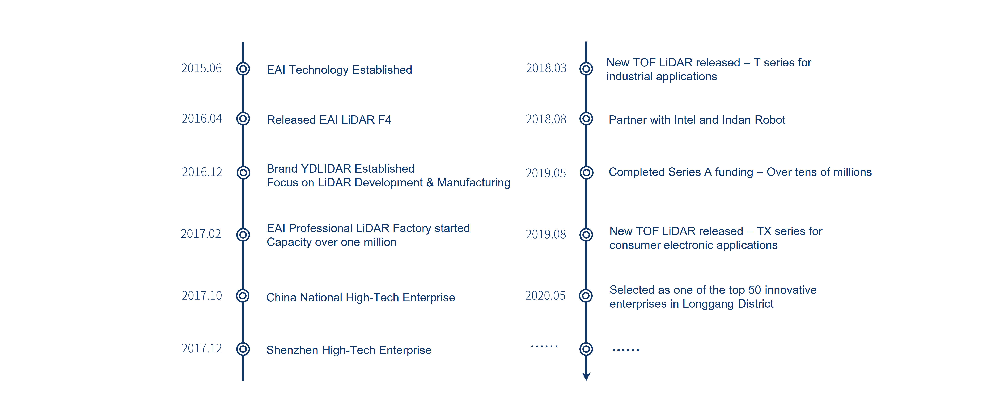

YDLIDAR SDK [](https://travis-ci.org/cansik/sdk) [](https://ci.appveyor.com/project/cansik/sdk) [](https://codebeat.co/projects/github-com-cansik-sdk-samsung)
=====================================================================


Introduction
-------------------------------------------------------------------------------------------------------------------------------------------------------

YDLIDAR(https://www.ydlidar.com/) series is a set of high-performance and low-cost LIDAR sensors, which is the perfect sensor of 2D SLAM, 3D reconstruction, multi-touch, and safety applications.

If you are using ROS (Robot Operating System), please use our open-source [ROS Driver]( https://github.com/ydlidar/ydlidar) .

Release Notes
-------------------------------------------------------------------------------------------------------------------------------------------------------
| Title      |  Version |  Data |
| :-------- | --------:|  :--: |
| SDK     |  2.2.5 |   2020-12-15  |

- [feat]  The FW version in LidarVersion changes from two bytes to one byte
- [feat]  Add logic of time reversal and time drift prevention and grant scan sequence[2021-01-19].

## How to Get Lidar Firmware Version number.
```
  CYdLidar laser;
  bool ret = laser.initialize();

  if (ret) {
    LidarVersion _version;
    memset(&_version, 0, sizeof(LidarVersion));
    laser.GetLidarVersion(_version);
    printf("Lidar FW: %d, HW: %d\n", _version.firmware, _version.hardware);
    fflush(stdout);
    ret = laser.turnOn();
  }

```


## How to Fetch zero angle tolerance values from lidar’s internal memory while lidar assembly.
```
  CYdLidar laser;
  if(laser.initialize()) {
    offset_angle robot_angle_tolerance;
    result_t ans = laser.getZeroOffsetAngle(robot_angle_tolerance);
    if(IS_OK(ans)) {
      printf("Fetch installation angle tolerance while lidar is assembled at the robot cleaner successfully\n");
    }
  }
```

## How to Get Rid Distortion Value.
```
  CYdLidar laser;
  if(laser.initialize()) {
    std::vector<offset_angle> rib_array;
    result_t ans = laser.getRibOffsetAngle(rib_array);
    if(IS_OK(ans)) {
      printf("get rib values is success...\n");
    }
  }
```

## How to Set Rid Distortion Value.
SDK can filter custom angular area Lidar data,`saveRibOffsetAngle` command use examples as follows:
* 1.filter 10 to 20 degrees and 50 to 60 degrees
```
  CYdLidar laser;
  if(laser.initialize()) {
    std::vector<offset_angle> rib_array;
    // 10 to 20
    offset_angle angle;
    angle.angle = 10*100;
    rib_array.push_back(angle);
    angle.angle = 20*100;
    rib_array.push_back(angle);
    //50 to 60
    angle.angle = 50*100;
    rib_array.push_back(angle);
    angle.angle = 60*100;
    rib_array.push_back(angle);
    laser.saveRibOffsetAngle(rib_array);
  }
```
* 2.filter 10 to 20 degrees, 50 to 60 degrees and 320 to 330 degrees.
```
 CYdLidar laser;
  if(laser.initialize()) {
    std::vector<offset_angle> rib_array;
    // 10 to 20
    offset_angle angle;
    angle.angle = 10*100;
    rib_array.push_back(angle);
    angle.angle = 20*100;
    rib_array.push_back(angle);
    //50 to 60
    angle.angle = 50*100;
    rib_array.push_back(angle);
    angle.angle = 60*100;
    rib_array.push_back(angle);

    //50 to 60
    angle.angle = 320*100;
    rib_array.push_back(angle);
    angle.angle = 330*100;
    rib_array.push_back(angle);
    laser.saveRibOffsetAngle(rib_array);
  }

```
Filtering angles need to be entered in pairs.

Note:
* When obtaining or saving the offset angle, you need to call the `initialize` function to initialize the lidar successfully.

## Support

You can get support from YDLidar with the following methods:
* Send email to support@ydlidar.com with a clear description of your problem and your setup
* Github Issues

## Contact EAI


If you have any extra questions, please feel free to [contact us](http://www.ydlidar.cn/cn/contact)
